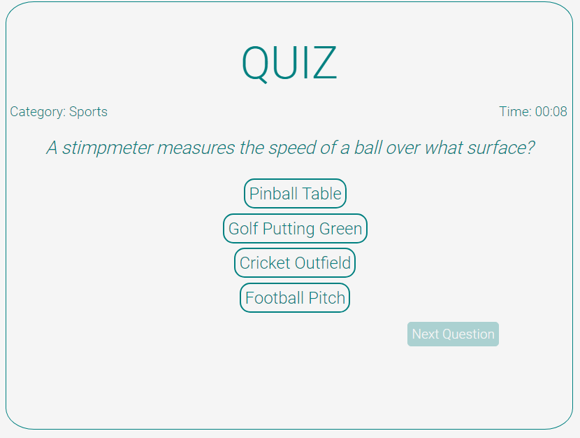

# QUIZ

## A simple quiz app made with Svelte

### Details

- A little quiz app with 10 question per round. The questions have 4 possible answers and user define the
  category and the level to play.  

- Inspiration: [App-ideas repo](https://github.com/florinpop17/app-ideas/blob/master/Projects/1-Beginner/Quiz-App.md)
- Questions came from here: [Open Trivia DB](https://opentdb.com/api_config.php)
- Code make with: [Svelte](https://svelte.dev/)

#### Images

#### Next steps

-Improve the code: Design Patterns

-Improve the code: Make the app responsive.
                   Add animations and Transitions
                   Add a logo and icons                 

